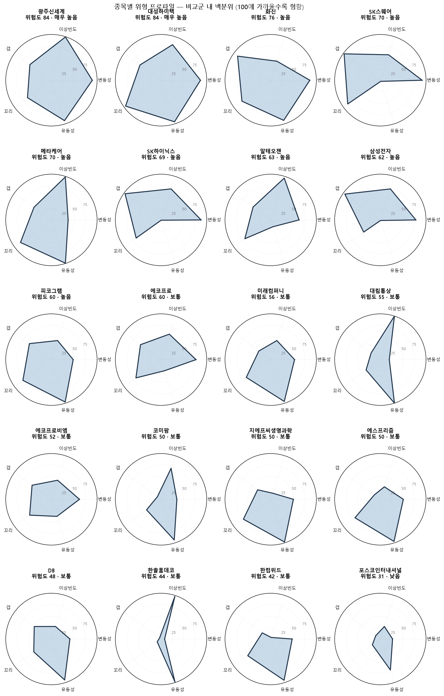
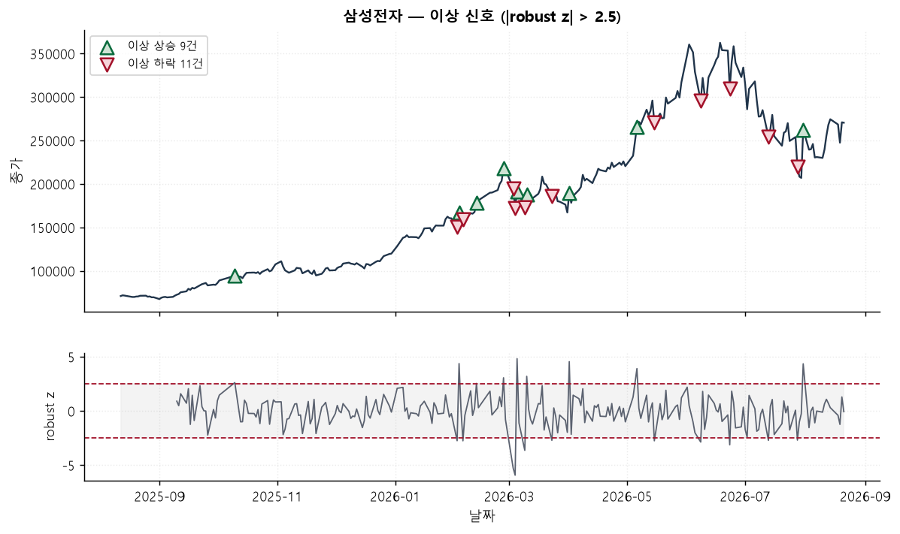
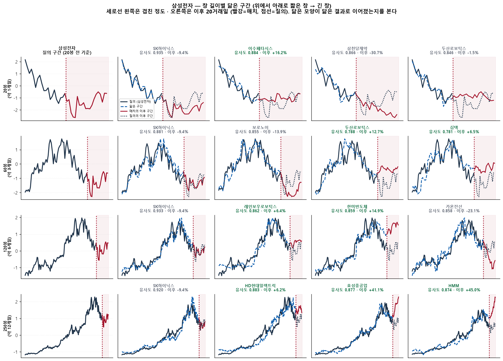
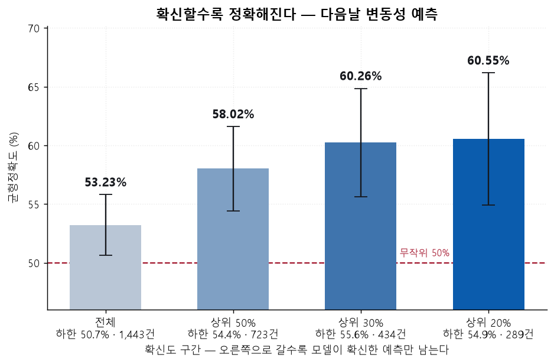
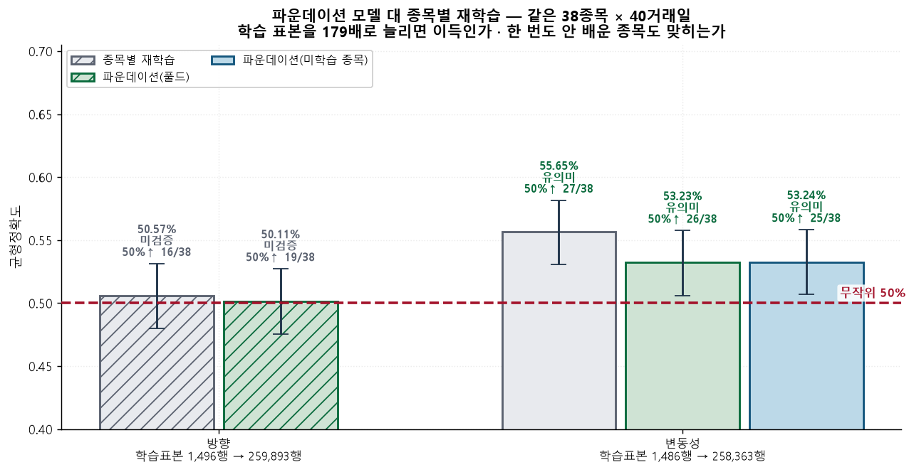
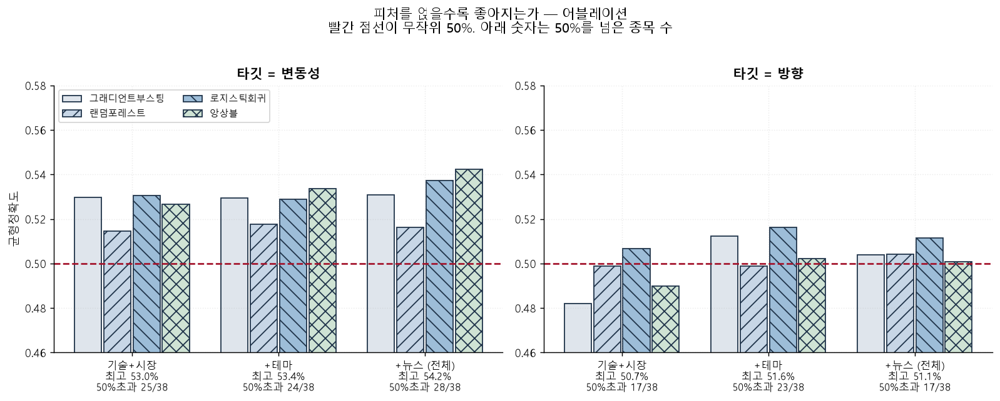

# accessible-investor — AI 엔진

저시력자·시각장애인용 주식 정보 도구의 **AI 파트**.

주식 정보는 대부분 **눈으로 보게** 만들어져 있다. 차트의 모양, 급등락을
알리는 반짝임 — 화면을 볼 수 없으면 이 정보가 통째로 사라진다. 숫자를
그대로 읽어 주는 것만으로는 부족하다. "종가 71,200원"을 들어도 **그게 큰
변화인지** 알 수 없기 때문이다.

이 엔진은 화면이 눈에게 해 주던 일을 **문장으로** 대신한다.

| 파트 | 하는 일 | 화면을 못 봐도 알게 되는 것 |
|---|---|---|
| [**이상감지 · 위험도**](results/01_anomaly/) | 평소와 다른 움직임을 등급으로 | "오늘 이 종목에 무슨 일이 있었나" |
| [**차트 유사도**](results/02_similarity/) | 닮은 과거 구간을 문장으로 | "지금 모양이 과거 어느 때와 닮았나" |
| [**다음날 예측**](results/03_forecast/) | 변동성·방향을 확률로 | "내일 조용할까, 크게 움직일까" |

**6,228종목**(코스피·코스닥·나스닥·S&P500) 어디에나 그대로 쓴다.

---

## 빠른 시작

```bash
pip install -r requirements.txt
```

`models/` 에 필요한 파일이 다 있어 **clone 직후 바로 돈다.**

```bash
python cli.py serve anomaly 알테오젠   # 이상 움직임 + 위험도
python cli.py serve similar NVDA     # 닮은 차트 종목
python cli.py serve predict 카카오    # 다음 거래일 예측
```

```python
from accessible_investor import serving as SV

SV.warm()                                   # 프로세스당 한 번 (약 5초)
print(SV.brief("005930", with_similar=True)["문안"])
```

```
삼성전자는 2026-08-21 기준 평소 범위 안에서 움직였습니다. 등락률 3.87퍼센트입니다.
이 종목의 위험도는 높음입니다. 다음 거래일(08월 24일) 크게 움직일 확률 39퍼센트,
잔잔할 확률 61퍼센트로 봅니다. 평소 하루 변동폭은 4.511퍼센트입니다.
```

`문안` 은 **스크린리더가 그대로 읽도록** 만든 필드다. UI 는 이 문장을
읽어 주고 배지 몇 개만 붙이면 된다. → [`INTEGRATION.md`](INTEGRATION.md)

---

## ① 이상감지 · 위험도

오늘 움직임이 **그 종목의 평소와 얼마나 다른지**를 등급으로 판정하고,
위험도 5축(변동성·이상빈도·갭·꼬리·유동성)을 100점 척도로 매긴다.

```
알테오젠은 2026-08-21 기준 이례적으로 움직였습니다. 하락 방향, 등락률 -5.74퍼센트입니다.
최근 60거래일 중 이런 날이 5번 있었습니다. 이 종목의 위험도는 높음입니다.
변동이 큰 편입니다. 분할 매수를 권합니다.
```

**시각장애인에게** — 화면을 보는 사람은 캔들 하나가 유난히 길면 한눈에
안다. 그 정보가 없으면 "-5.74%"라는 숫자만 남는데, 어떤 종목은 매일
5%씩 움직이고 어떤 종목은 1년에 한 번 그런다. 그래서 절대 수치가 아니라
**그 종목의 평소 대비**로 판정한다. 위험도는 처음 접하는 종목을 살 때,
차트를 훑어보며 느끼는 "이 종목 좀 험하네"를 6년치 분포 대비 백분위로
바꿔 문장으로 준다.

**결과** — 학습 랭커가 규칙 기준선 대비 **PR-AUC 3.0배**(0.1078 vs 0.0357).
같은 알림 예산으로 3배 많은 이상신호를 잡는다. 응답 **15ms**.



5축을 펼친 프로파일. 같은 "위험도 높음"이라도 갭이 큰 종목과 유동성이
낮은 종목은 대응이 다르다.



세로선이 이상으로 판정된 날. 뭉쳐서 나오는 구간이 보이는데, 한 번
흔들린 종목은 며칠 더 흔들린다는 뜻이라 위험도 축의 하나로 넣었다.

---

## ② 차트 유사도

지금 모양과 **닮은 과거 구간**을 794종목 6년치에서 찾아 문장으로 준다.
1·3·6·12개월 네 개의 창에서 각각 찾는다.

```
삼성전자의 최근 120봉 모양과 가장 닮은 구간은 ISC의 2023년 10월 구간입니다.
유사도 0.87입니다. 그 구간 이후 20거래일 동안 3.91퍼센트 움직였습니다.
```

**시각장애인에게** — 차트 모양은 시각 정보 그 자체라 접근성이 가장 낮다.
숫자를 아무리 읽어 줘도 "지금 어떤 국면인가"라는 감각은 전달되지 않는다.
유사도는 그것을 **비교로** 바꾼다. 차트를 훑어보는 사람이 머릿속에서 하는
일과 같은 종류의 정보이고, 사람은 자기가 아는 몇 종목만 떠올리지만 이
검색은 794종목 전체를 본다.

**어떻게** — "닮았다"를 네 성분으로 나눠 재고, **모양이 순위를 정하도록**
가중을 준다. 후보를 300개 넓게 뽑아 다시 정렬하는 2단 검색이라 한 성분만
높은 구간이 위로 올라오지 못한다.

| 성분 | 가중 | 보는 것 |
|---|---|---|
| 형태상관 | 0.70 | 굴곡의 모양이 같은가 |
| 진폭일치 | 0.20 | 흔들린 크기가 비슷한가 |
| 수익률상관 | 0.10 | 일별 움직임이 같이 가는가 |

**결과** — 종합점수와 형태상관의 상관이 **0.909**. 유사도가 높게 나온
구간은 실제로 모양이 닮았다.



검은 실선이 지금 구간, 파란 점선이 찾아낸 과거 구간, 빨간 점선이 그 뒤에
실제로 어떻게 됐는지다. 네 창을 나란히 놓아 짧은 창과 긴 창이 서로 다른
구간을 짚는 것까지 보인다.

---

## ③ 다음날 예측

다음 거래일에 대해 **변동성**(크게 움직일까)과 **방향**(오를까)을 확률로
준다. 장중에 물으면 "오늘", 장 마감 후에 물으면 "다음 거래일"로 시점을
맞춰 말한다.

```
카카오는 다음 거래일(08월 24일) 크게 움직일 확률 61퍼센트, 잔잔할 확률 39퍼센트로
봅니다. 평소 하루 변동폭은 3.2퍼센트입니다. 최근 5일치 뉴스가 긍정 쪽이라
그것도 함께 반영했습니다.
```

**시각장애인에게** — 화면을 보는 사람은 호가창이 빠르게 바뀌는 것을 보고
"오늘 심상치 않네"를 실시간으로 느낀다. 그 감각이 없으면 장이 끝나고
나서야 무슨 일이 있었는지 안다. "내일 크게 움직일 확률 61%"를 미리 알면
그날 몇 번 더 확인할지, 분할로 들어갈지를 **미리** 정할 수 있다. 실시간
감시를 못 하는 사람에게 사전 정보는 실시간 정보의 자리를 대신한다.
방향은 상승·하락 확률을 숫자 하나로 줘서, 여러 화면을 오가며 이동평균·
거래량·뉴스를 각각 확인하고 머릿속에서 합치는 과정을 없앤다.

가격만 보면 "왜 움직였는가"가 빠지므로 최근 5일치 기사 감성을 피처
4개로 만들어 함께 넣는다.

**결과 — 확신할 때만 보면** 트레이딩 도구는 매일 모든 종목에 알림을 걸지
않는다. 확신이 설 때만 말을 건다. 고르는 규칙은 미리 정해 둔 하나다 —
`|상승확률 − 임계값|` 이 큰 순.

| 구간 | 균형정확도 | 95% 신뢰하한 | 건수 |
|---|---|---|---|
| 확신도 **상위 50%** | **58.02%** | 54.42% | 723 |
| 확신도 **상위 30%** | **60.26%** | 55.65% | 434 |
| 확신도 **상위 20%** | **60.55%** | 54.91% | 289 |

**확신이 클수록 정확해진다.** 모델이 아는 것과 모르는 것을 스스로 구분하고
있다는 뜻이고, 알림을 걸 대상을 고르는 근거가 된다.



구간을 좁힐수록 막대가 올라가고, 신뢰구간 하한이 무작위선(50%) 위로
확실히 떨어진다. 국내 종목만 보면 전체 구간에서도 **54.79%** 다.
근거 → [`confidence_tiers.csv`](results/03_forecast/data/confidence_tiers.csv)

지표는 **균형정확도**다. 오르는 날이 60%인 시장에서 "무조건 상승"이라
답하면 일반 정확도는 60%지만 균형정확도는 정확히 50%가 된다. 쏠림이
얼마든 50%가 진짜 무작위가 되도록 맞춘 척도다.



종목마다 따로 학습한 모델과 전 종목을 한 번에 학습한 모델을 같은 평가
행에서 나란히 잰 그림. 정확도는 비슷한데 조회 지연이 **7,000ms 대 167ms**
로 갈린다.



어느 피처가 기여했는지 하나씩 빼며 잰 결과. 기술지표만으로는 부족하고
**시장맥락**(지수 대비 초과수익·베타)이 들어가야 올라간다.

---

## 파운데이션 모델 — 6,228종목에 하나로

**전 종목을 한 판에 쌓아 한 번만 학습**한다. 153종목 263,277행으로 학습한
모델 하나가 6,228종목에 답한다. 조회 시점에는 학습하지 않고 확률만
계산하므로 **167ms** 에 끝나고, 신규 상장주도 30봉만 있으면 답이 나간다.

**그냥 많이 넣은 게 아니다.** 종목을 섞어 쌓으려면 행끼리 같은 척도여야
한다. 삼성전자의 71,200원 행과 NVDA의 $178 행을 그대로 쌓으면 모델은 통화
단위를 배운다. 그래서 피처 32개를 **전부 무차원으로** 설계했다 — 수익률,
이격률, RSI, 베타, 지수 대비 초과수익. 어느 것도 원 단위나 달러 단위가
아니라서 삼성전자 행과 NVDA 행이 같은 척도가 된다.

**종목 식별자는 일부러 넣지 않았다.** 종목 임베딩을 넣으면 학습에 없던
종목에 쓸 값이 없다. 6,228종목에 배포하려면 모델이 종목을 외우는 게 아니라
**종목 사이에 공통된 것**을 배워야 한다.

**처음 보는 종목도 맞힌다.** 평가 38종목을 학습에서 통째로 빼고
(153 → 115종목) 다시 학습해 그 38종목을 맞혀 봤다.

| | 균형정확도 | 95% 신뢰구간 |
|---|---|---|
| 학습에 포함된 종목 | 53.23% | [50.61, 55.77] |
| **한 번도 학습 안 한 종목** | **53.24%** | [50.68, 55.78] |

차이 **0.01%p**. 성능이 종목을 외워서 나온 게 아니라는 근거다.

**무작위 60종목 실측** — 네 지수에서 15종목씩 무작위로 뽑아 세 기능을 전부
호출했다.

```
180호출 (60종목 × 3기능) · 121초
예측 60/60 · 이상감지 60/60 · 유사도 60/60 · 실패 0
```

### 범용 파운데이션 모델(TabPFN)과 견줘 봤다

표 형태 데이터의 파운데이션 모델로 잘 알려진 **TabPFN** 과 같은 과제·같은
테스트셋(20,000건)에서 나란히 쟀다.

| 모델 | 학습 표본 | PR-AUC | ROC-AUC | 추론 시간 |
|---|---|---|---|---|
| **이 저장소 모델** | 109,500 | **0.2490** | **0.8424** | **50.9ms** |
| TabPFN | 1,000 | 0.1992 | 0.8170 | 227,667ms |
| 규칙 기준선 | — | 0.1058 | 0.6767 | — |

**정확도는 1.25배, 추론은 4,473배 빠르다.** TabPFN 은 학습 없이 바로 쓰는
대신 추론할 때마다 전체 표본을 다시 훑기 때문에 20,000건에 **3분 47초**가
든다. 관심종목 화면은 한 번 그릴 때 수십 종목을 물어보므로 이 구조로는
성립하지 않는다.

그래서 같은 발상(한 모델로 모든 종목)을 **미리 학습해 두는 쪽**으로
가져왔다. 학습을 한 번만 하고 조회할 때는 확률만 계산하니, 정확도는 더
높으면서 응답은 밀리초 단위로 끝난다.
근거 → [`13_tabpfn_bench.csv`](results/01_anomaly/validation/13_tabpfn_bench.csv)

---

## 트레이딩 툴에 붙이기

키움 API 로 받은 일봉을 그대로 넘기면 된다.

```python
r = SV.brief("196170", bars=kiwoom_df, with_similar=detail)
```

| | 내용 |
|---|---|
| 입력 | 종목코드(또는 종목명) + 일봉 OHLCV |
| 지연 | 예측 **167ms** · 이상감지 **15ms** · 유사도 **14ms** |
| 신규상장 | 짧으면 `신뢰도` 를 낮춰 응답 |
| 네트워크 | `bars` 를 넘기고 `with_news=False` 면 **요청 0건** |
| 스레드 | 읽기 전용이라 안전. 프로세스당 `warm()` 한 번 |

### 배포 파일 (`models/`, 8.7MB)

| 파일 | 쓰는 곳 | 내용 |
|---|---|---|
| `registry.parquet` | 공통 | 6,228종목 (코드·이름·시장·섹터·상장일) |
| `pooled_변동성.pkl` | 예측 | **파운데이션 예측 모델 (주력)** |
| `pooled_방향.pkl` | 예측 | 파운데이션 예측 모델 (방향) |
| `news_transfer.pkl` | 예측 | 뉴스 감성 → 피처 변환 |
| `ranker_5m.pkl` | 이상감지 | 이상신호 랭커 |
| `risk_reference.json` | 이상감지 | 위험도 5축 기준분포 |
| `refpanel_KR/US.parquet` | 유사도 | 비교군 종가 패널 (794종목 × 6년) |

clone 하면 **네트워크 없이 바로 기동**된다.

---

## 명령어

```bash
python cli.py serve health              # 배포 파일 점검
python cli.py serve brief 삼성전자        # 세 기능 한 번에
python cli.py results                   # 표·그림 전체 재생성
python cli.py train --target 변동성       # 파운데이션 모델 재학습
```

전체 요약은 [`results/index.html`](results/index.html) 한 장으로 본다.
데이터 출처와 패키지 고지는 [`NOTICE.md`](NOTICE.md).
